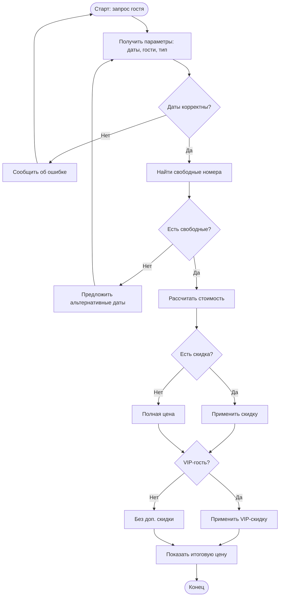

# Flowchart — проверка доступности и расчёт стоимости

```mermaid
flowchart TD
    A([Старт: запрос гостя]) --> B[Получить параметры: даты, гости, тип]
    B --> C{Даты корректны?}
    C -->|Нет| C1[Сообщить об ошибке] --> A
    C -->|Да| D[Найти свободные номера]
    D --> E{Есть свободные?}
    E -->|Нет| E1[Предложить альтернативные даты] --> B
    E -->|Да| F[Рассчитать стоимость]
    F --> G{Есть скидка?}
    G -->|Да| G1[Применить скидку]
    G -->|Нет| G2[Полная цена]
    G1 --> H{VIP-гость?}
    G2 --> H
    H -->|Да| H1[Применить VIP-скидку]
    H -->|Нет| H2[Без доп. скидки]
    H1 --> I[Показать итоговую цену]
    H2 --> I
    I --> J([Конец])
```