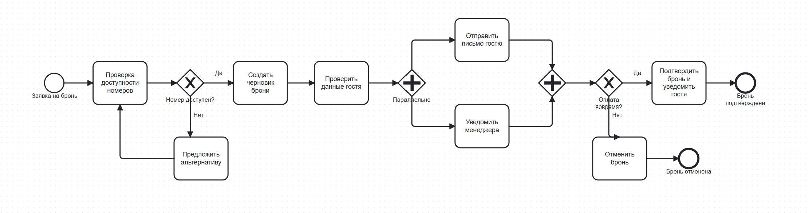
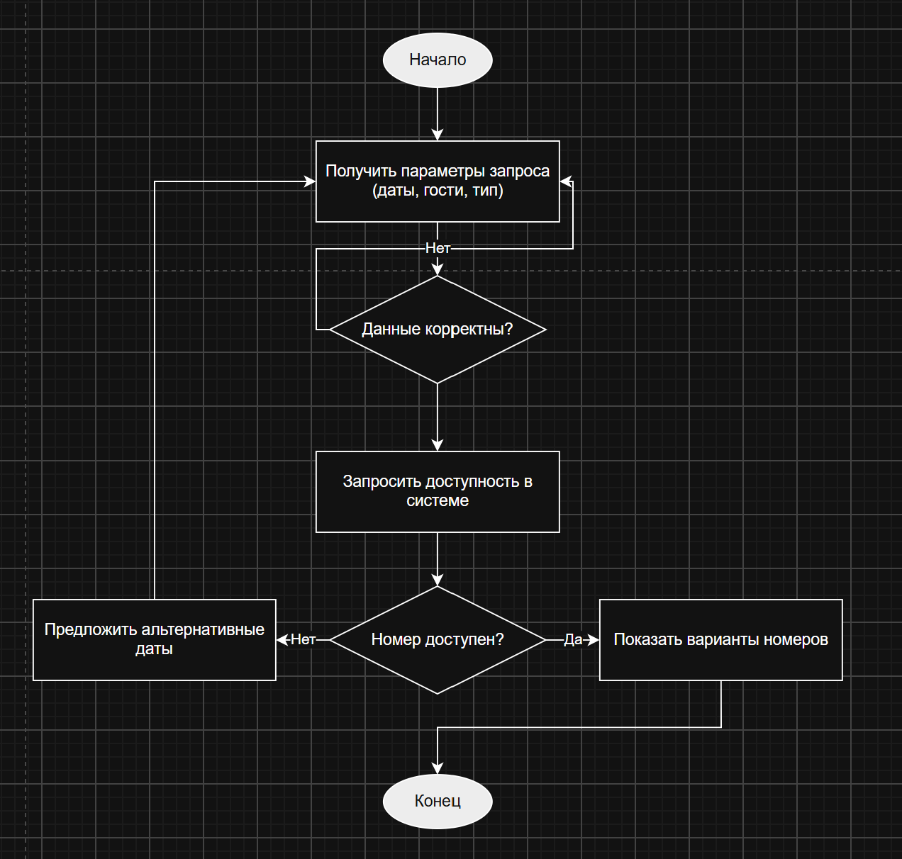

# Отчёт по лабораторной работе №1

**Тема:** Бронирование номера в отеле
**Студент:** Крупа Ксения
**Университет:** ГрГУ им. Я. Купалы

## 1. Краткое описание процесса

Процесс описывает полный цикл бронирования номера в отеле: от запроса гостя
до подтверждения брони и заселения. Участники — гость, система бронирования,
платёжный шлюз, менеджер отдела бронирования, служба Housekeeping и
Email/SMS-сервис. Процесс включает проверку доступности номера, создание
черновика брони, параллельную отправку уведомлений гостю и менеджеру,
обработку оплаты и подтверждение. В процессе два ветвления (номер недоступен,
оплата не прошла вовремя) и одно параллельное действие (уведомления гостю и
менеджеру одновременно).

Полное текстовое описание: [docs/process_description.md](docs/process_description.md)

## 2. Диаграммы

### 2.1. BPMN-диаграмма

Исходник: [diagrams/process.bpmn](diagrams/process.bpmn)

### 2.2. UML Activity Diagram

Исходник: [diagrams/activity.drawio](diagrams/activity.drawio)

### 2.3. Sequence Diagram (Mermaid)

Исходник: [docs/sequence.md](docs/sequence.md)

### 2.4. Flowchart (Mermaid)

Исходник: [docs/flowchart.md](docs/flowchart.md)

## 3. Выводы

В ходе работы я научилась настраивать Git, работать с SSH-ключами и
публиковать проект на GitHub. Разобралась, чем отличаются разные нотации
моделирования бизнес-процессов: BPMN удобен для описания взаимодействия
ролей и событий, UML Activity — для алгоритмов с ветвлениями, а Mermaid —
для быстрого текстового описания диаграмм прямо в Markdown.

Отдельно поняла, как Git отслеживает изменения: текстовые файлы (XML,
Markdown) показываются в diff построчно, а бинарные (PNG) — только как
"binary files differ". Поэтому исходники диаграмм важно хранить в текстовом
формате, а PNG — как производный результат для отчёта.

Ещё один полезный навык — видеть разницу между исходным форматом
диаграммы и её визуализацией, а также уметь объяснить каждый элемент на
схеме.