# Отчёт по лабораторной работе №2 — Node-RED

**Студент:** Крупа Ксения, группа ИИ-241, ГрГУ им. Я. Купалы
**Дисциплина:** Технологии визуального программирования
**Тема:** Node-RED как low-code инструмент
**Репозиторий:** `visual-programming-labs-Krupa`, каталог `lab2/`

---

## 1. Что сделано (кратко)

| Часть задания | Результат |
|---------------|-----------|
| Часть 1. Установка и запуск | Node-RED запущен в Docker-контейнере, порт `1880`, volume `lab2/node-red-data` → `/data`. Собран и задеплоен поток `inject → debug` |
| Часть 2. Ноды и потоки | Собраны все 12 потоков из пунктов 2.1–2.12 — каждый лежит отдельным файлом в `lab2/flows/` |
| Часть 3. Ачивка | **Ачивка №5. REST+ (полный CRUD)** — потоки `flow-13-rest-crud.json` |
| Часть 4. Отчёт | Этот файл, [`api.md`](api.md), чек-лист скриншотов, 11 осмысленных коммитов |

Всего: **13 потоков, 116 нод**, 9 HTTP-эндпоинтов, 2 внешние интеграции (публичный HTTP API и публичный MQTT-брокер).

### 1.1. Как обеспечена уникальность работы

Задание требует использовать **фамилию и группу** студента в `msg.topic`, именах,
payload и названиях потоков. Применена такая схема:

| Где | Как выглядит |
|-----|--------------|
| `msg.topic` | `lab2/krupa-ii241/basic`, `lab2/krupa-ii241/function`, … |
| Топик MQTT | `student/krupa-ii241/lab2/sensor` |
| Названия потоков (вкладок редактора) | `01 · inject → debug (ИИ-241)` — во всех 13 |
| Подписи на полотне (ноды `comment`) | `2.1 inject → debug · ИИ-241` — во всех 13 |
| `msg.payload` и ответы API | `"student": "Крупа Ксения (ИИ-241)"` — 40 мест |
| Имена inject-нод | `Каждые 5 сек: Крупа Ксения (ИИ-241)` |
| Файл лога из 2.11 | `/data/krupa-ii241-log.jsonl` |
| Имя Telegram-бота | `tvl_lab2_krupa_bot` — здесь шаблон задания задаёт только фамилию |

Почему в топиках, URL и именах файлов стоит латинский слаг `krupa-ii241`,
а не `Крупа-ИИ-241`: кириллица в MQTT-топике формально допустима, но ломается
при работе с частью брокеров и утилит, которые ожидают ASCII. Поэтому топик и путь
к файлу сделаны латиницей, а во всех читаемых местах (имена нод, подписи, payload,
ответы API) используется полный вариант **«Крупа Ксения (ИИ-241)»**.

Отдельно про эндпоинт `GET /api/info`: по заданию он обязан возвращать JSON
**ровно с двумя полями**. Чтобы требование не нарушить и при этом показать и фамилию,
и группу, оба значения объединены в одном поле:

```json
{
  "student": "Крупа Ксения (ИИ-241)",
  "lab": 2
}
```

Так формат ответа остаётся единообразным: во всех остальных эндпоинтах поле
`student` содержит то же значение.

Группа также передаётся контейнеру переменной окружения `LAB2_GROUP` (поток 2.12
показывает её в Debug) — файл `lab2/scripts/lab2.env`, подключается через
`docker run --env-file`. Переменные передаются файлом в UTF-8, а не флагами `-e`:
в командной строке Windows русский текст проходит через ANSI-кодировку и доходит
до контейнера искажённым.

---

## 2. Способ установки и версии

### 2.1. Почему Docker

Задание рекомендует Docker, и у него здесь два реальных преимущества:

1. **Изоляция.** Node-RED не ставится глобально в систему и не тянет за собой сотни пакетов в `%APPDATA%\npm`.
2. **Volume.** Каталог `/data` внутри контейнера смонтирован на папку репозитория, поэтому `flows.json`, лог-файл из потока 2.11 и настройки лежат на хосте и **переживают пересоздание контейнера**. Это понадобилось в п. 2.11, где требовалось показать сохранение данных между перезапусками.

### 2.2. Команда запуска

```powershell
docker run -d --name krupa-lab2-nodered `
  -p 1880:1880 `
  -v "C:\Users\Ksenia\study\visual-programming-labs-Krupa\lab2\node-red-data:/data" `
  -e LAB2_STUDENT=Krupa `
  -e LAB2_LAB=2 `
  --restart unless-stopped `
  nodered/node-red:latest
```

Разбор параметров:

| Параметр | Смысл |
|----------|-------|
| `-d` | контейнер работает в фоне |
| `--name krupa-lab2-nodered` | понятное имя, видно в `docker ps` |
| `-p 1880:1880` | порт 1880 хоста → порт 1880 контейнера (редактор на <http://localhost:1880>) |
| `-v <хост-папка>:/data` | обязательный по заданию volume: папка хоста ↔ `/data` в контейнере |
| `-e LAB2_STUDENT`, `-e LAB2_LAB` | переменные окружения для потока 2.12 |
| `--restart unless-stopped` | контейнер поднимается сам после перезагрузки ОС |
| `nodered/node-red:latest` | официальный образ с уже установленным Node-RED |

### 2.3. Версии

| Компонент | Версия | Как проверено |
|-----------|--------|---------------|
| Node-RED | **v5.0.8** | меню (☰) → About; `docker exec krupa-lab2-nodered node-red -v` |
| Node.js (в контейнере) | **v24.21.0** | `docker exec krupa-lab2-nodered node -v` |
| ОС контейнера | Linux 6.18.33.2-microsoft-standard-WSL2 x64 | строка `Linux ...` в логе запуска |
| Образ | `nodered/node-red:latest` (digest `sha256:b5adb6c9dd29…`) | `docker ps`, вывод `docker pull` |
| Docker | 29.8.0 | `docker --version` |
| Node.js на хосте | v22.23.2 | `node -v` (использовался только для генерации JSON-файлов потоков) |
| `node-red-dashboard` | **3.6.6** | `/data/package.json`; строка `Dashboard version 3.6.6 started at /ui` в логе |
| `node-red-contrib-telegrambot` | **19.0.3** | `/data/package.json`; строка `node-red-contrib-telegrambot version: v19.0.3` в логе |

Контейнер виден в `docker ps`:

```
CONTAINER ID   IMAGE                     STATUS                    PORTS                                         NAMES
4e328269b394   nodered/node-red:latest   Up 56 seconds (healthy)   0.0.0.0:1880->1880/tcp, [::]:1880->1880/tcp   krupa-lab2-nodered
```

Строки из лога запуска, подтверждающие, что всё поднялось:

```
[info] Node-RED version: v5.0.8
[info] Node.js  version: v24.21.0
[info] node-red-contrib-telegrambot version: v19.0.3
[info] Dashboard version 3.6.6 started at /ui
[info] User directory : /data
[info] Flows file     : /data/flows.json
[info] Started flows
[info] [mqtt-broker:HiveMQ public broker] Connected to broker: mqtt://broker.hivemq.com:1883
```

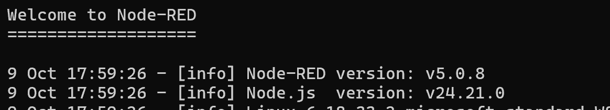

---

## 3. Освоенные ноды

### 3.1. Базовые (Часть 2)

| Нода | Пункт | Что именно освоено |
|------|-------|--------------------|
| `inject` | 2.1, 2.2, 2.3, 2.4, 2.5, 2.6, 2.7, 2.9, 2.11, 2.12, 2.13 | ручной запуск, `Repeat = interval` (5 с / 3 с / 2 с), `Inject once after` при деплое, задание сразу нескольких свойств (`payload`, `topic`), типы `string` / `number` / `JSON` / `timestamp` |
| `debug` | все потоки | два режима вывода: только `msg.payload` и `complete msg object`; панель Debug в правом sidebar |
| `function` | 2.2, 2.3, 2.7, 2.8, 2.9, 2.10, 2.11, 2.12, 2.13 | JavaScript в ноде: `let`/`const`, `if/else`, цикл `for`, массивы, объекты, `return msg`, `return null` для отбрасывания сообщения, работа с `msg.req`, `flow`, `global`, `env` |
| `switch` | 2.3 | ветвление по `msg.payload.avg`, правила `>=` и `otherwise`, два выхода, `checkall` |
| `change` | 2.4 | операции `Set` над `msg.topic`, `msg.timestamp`, `msg.payload`; тип значения `timestamp` (текущее время); вычисление через **JSONata** |
| `template` | 2.5 | Mustache-шаблон, `Syntax = Mustache template`, `Property = msg.payload`, `Output = parsed JSON` |
| `http request` | 2.6 | GET-запрос к публичному API, `Return = a parsed JSON object` |
| `mqtt out` / `mqtt in` | 2.7 | конфиг-нода MQTT-брокера, публикация и подписка в одном топике, `QoS 0` |
| `http in` / `http response` | 2.8, 2.13 | метод (`GET`, `POST`, `PATCH`, `DELETE`), URL с path-параметром, `msg.req.query` / `msg.req.params`, статусы 200/201/400/404 через `msg.statusCode`, свои заголовки через `msg.headers` |
| `file` (запись) / `file in` (чтение) | 2.11 | дописывание в файл (`appendNewline`), создание каталога, чтение целиком в UTF-8 |
| `comment` | все потоки | текстовые подписи прямо на полотне — чтобы на защите не приходилось вспоминать назначение потока |

### 3.2. Расширенные

| Нода | Пункт | Что именно освоено |
|------|-------|--------------------|
| `ui_gauge` | 2.9 | установка `node-red-dashboard`, тип `gage`, `min`/`max`, цветовые сегменты, `title`/`label` |
| `ui_chart` | 2.9 | линейный график истории, `xformat = HH:mm:ss`, `removeOlder = 5` минут, оси `ymin`/`ymax` |
| `ui_group`, `ui_tab` | 2.9 | группировка виджетов и отдельная вкладка дашборда с осмысленными подписями |
| `telegram bot`, `telegram command`, `telegram receiver`, `telegram sender` | 2.10 | бот через BotFather, регистрация команд (`/start`, `/help`, `/time`), эхо-ответ на произвольный текст, формат `msg.payload = { chatId, type, content }` |

### 3.3. Своя архитектура поверх нод

| Приём | Где применён |
|-------|--------------|
| `msg.statusCode` + `msg.headers` из function-ноды | 2.8, ачивка 5 |
| `flow context` как хранилище состояния | 2.12 (`krupa_counter`), ачивка 5 (`krupa_tasks`) |
| `global context` как общая память между потоками | 2.12 (`krupa_history`) |
| `env.get()` — переменные окружения контейнера | 2.12 (`LAB2_STUDENT`, `LAB2_LAB`) |
| `msg.filename` вместо жёсткого пути в ноде | 2.11 (путь приходит в сообщении, а не зашит) |

---

## 4. Потоки Части 2

Кратко по каждому. Полное описание HTTP-эндпоинтов — в [`api.md`](api.md).

### 4.1. Inject → Debug (`flow-01-inject-debug.json`)

Inject раз в 5 секунд кладёт в `msg.payload` строку `Крупа Ксения`, а в `msg.topic` — `lab2/krupa-ii241/basic`.
Debug переключён с режима «только `msg.payload`» на **complete msg object**, поэтому в панели видно весь объект: `payload`, `topic`, `_msgid`.

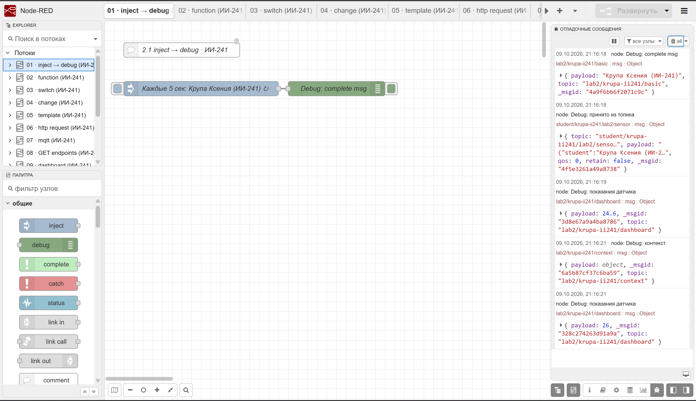

### 4.2. Function node (`flow-02-function.json`)

Три inject-ноды по очереди отправляют в одну функцию число `5`, строку `Крупа Ксения` и объект с массивом оценок — чтобы три ветки `if/else` отработали все.

Код функции использует `const`, `let`, `if/else if/else`, циклы `for`, массив и объект:

```js
const input = msg.payload;
let inputType = typeof input;
let values = [];

if (Array.isArray(input)) { inputType = "array"; values = input.slice(); }
else if (input !== null && typeof input === "object") { inputType = "object"; values = Array.isArray(input.scores) ? input.scores.slice() : []; }
else if (typeof input === "number") { inputType = "number"; for (let i = 1; i <= input; i++) { values.push(i); } }
else { inputType = "string"; values = String(input).split(/\s+/).filter(Boolean).map(w => w.length); }

let sum = 0;
for (let i = 0; i < values.length; i++) { sum += values[i]; }
const avg = values.length > 0 ? sum / values.length : 0;
```

Функция возвращает **объект с полем `payload`**:

```js
msg.payload = {
    student: msg.student,
    inputType: inputType,
    values: values,
    count: count,
    sum: sum,
    avg: Number(avg.toFixed(2)),
    verdict: verdict
};
return msg;
```

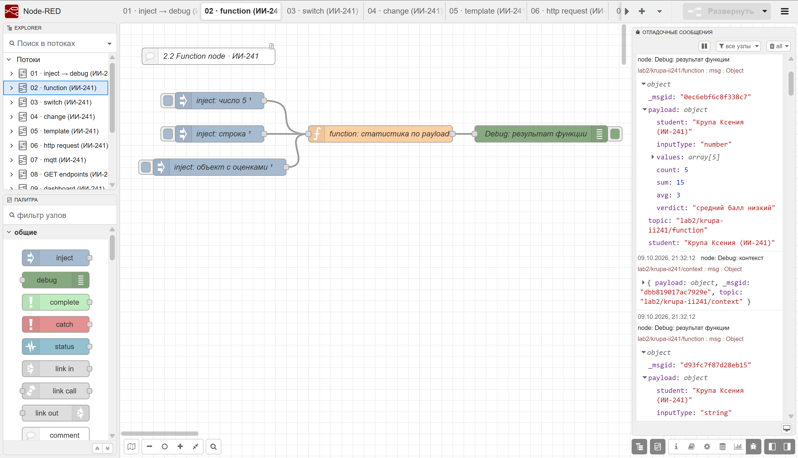

### 4.3. Switch node (`flow-03-switch.json`)

Логика функции — та же, что в 2.2. Switch ветвит по `msg.payload.avg`:

* правило 1 — `>= 4` (тип `number`);
* правило 2 — `otherwise`.

Два debug-ноды висят на разные выходы, поэтому в панели Debug сразу видно, в какую ветку попало сообщение.

```json
"rules": [{ "t": "gte", "v": "4", "vt": "num" }, { "t": "else" }]
```

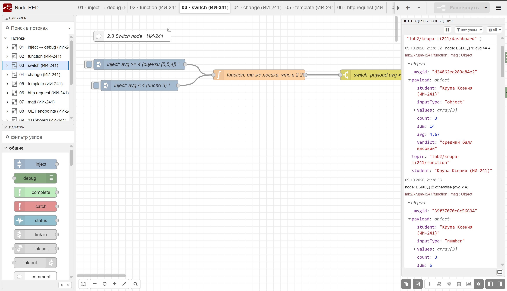

### 4.4. Change / Set node (`flow-04-change.json`)

Change-нода выполняет четыре операции `Set`:

| № | Свойство | Значение | Тип |
|---|----------|----------|-----|
| 1 | `msg.topic` | `lab2/krupa-ii241/change` | строка |
| 2 | `msg.timestamp` | текущее время | timestamp |
| 3 | `msg.changedBy` | `Крупа Ксения` | строка |
| 4 | `msg.payload` | `"Крупа Ксения \| lab2 \| было: " & $string(payload)` | JSONata |

Здесь важно, что Node-RED позволяет не только подставить константу, но и **вычислить значение выражением JSONata**.

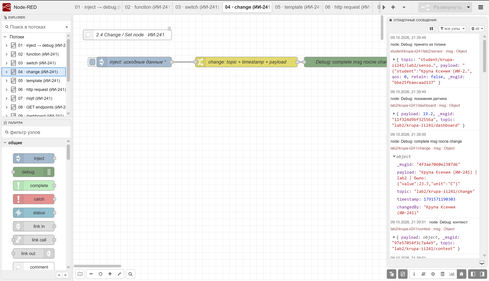

### 4.5. Template node (`flow-05-template.json`)

Inject отдаёт объект с полями `student`, `lab`, `sensor`, `value`, `unit`. Mustache-шаблон собирает из него JSON:

```
{
  "student": "{{payload.student}}",
  "lab": {{payload.lab}},
  "topic": "lab2/krupa-ii241/template",
  "measurement": {
    "sensor": "{{payload.sensor}}",
    "value": {{payload.value}},
    "unit": "{{payload.unit}}"
  },
  "summary": "{{payload.sensor}}: {{payload.value}} {{payload.unit}} у студента {{payload.student}}"
}
```

Настройки ноды: `Syntax = Mustache template`, `Property = msg.payload`, `Output = parsed JSON`.

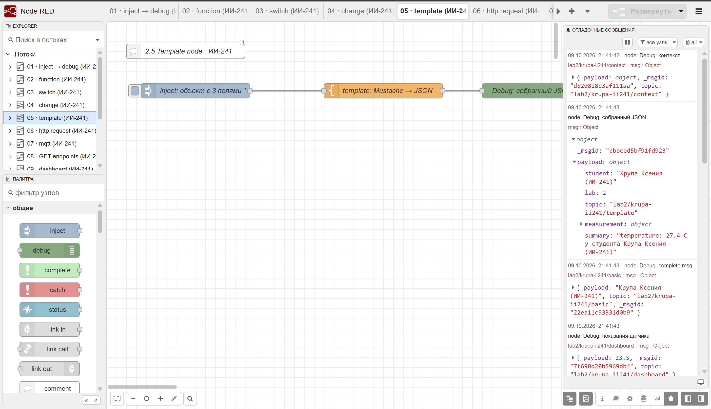

### 4.6. HTTP Request node (`flow-06-http-request.json`)

Публичный API без регистрации и токенов: `https://api.chucknorris.io/jokes/random`.
Метод `GET`, `Return = a parsed JSON object` — на выходе ноды сразу объект, а не строка.

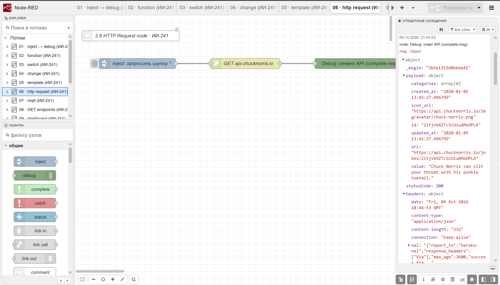

### 4.7. MQTT с публичным брокером (`flow-07-mqtt.json`)

* Брокер: `broker.hivemq.com:1883` (публичный, без авторизации). Альтернатива из задания — `test.mosquitto.org:1883`.
* Топик: `student/krupa-ii241/lab2/sensor`.
* **Ветка публикации:** inject раз в 5 секунд → function, которая формирует случайное «показание датчика» 18…30 °C → `mqtt out`.
* **Ветка подписки:** `mqtt in` на тот же топик → `debug`.

Так как обе ветки в одном потоке, опубликованное сообщение возвращается из брокера и попадает в Debug — это и есть доказательство, что публикация и подписка работают.

Полезное свойство MQTT, которое здесь видно: брокер не хранит историю, он только раздаёт сообщения текущим подписчикам. Если подписка не активна в момент публикации, сообщение теряется (при `QoS 0` и `retain = false`).

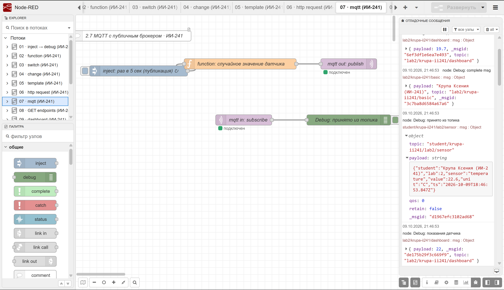

### 4.8. GET-эндпоинты (`flow-08-endpoints.json`)

Три обязательных эндпоинта, у каждого — своя пара `http in` + `http response`:

| Эндпоинт | Что возвращает | Ошибки |
|----------|----------------|--------|
| `GET /api/text` | простой текст, `Content-Type: text/plain` | — |
| `GET /api/info` | JSON ровно с двумя полями: `student`, `lab` | — |
| `GET /api/items?limit=&category=` | JSON-каталог товаров, фильтр по категории | `400`, если `limit` не целое число от 1 до 5 |
| `GET /api/items/:id` | один товар по path-параметру | `400`, если `id` не число; `404`, если товара нет |

Четвёртый эндпоинт добавлен, чтобы одним потоком закрыть и **query params** (`?limit=`, `?category=`), и **path params** (`/api/items/3`), как того требует задание.

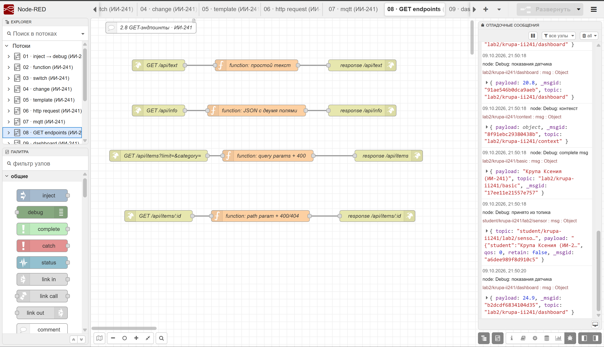

Успешный запрос:

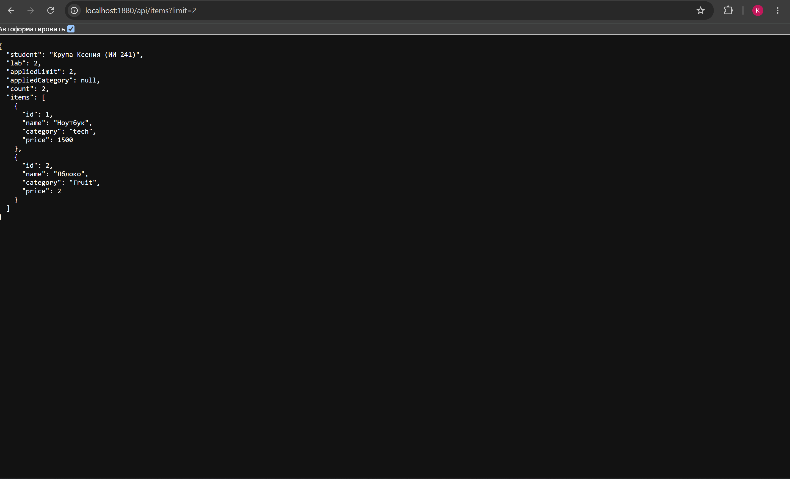

Ошибка `400` — `limit=99` вне диапазона:

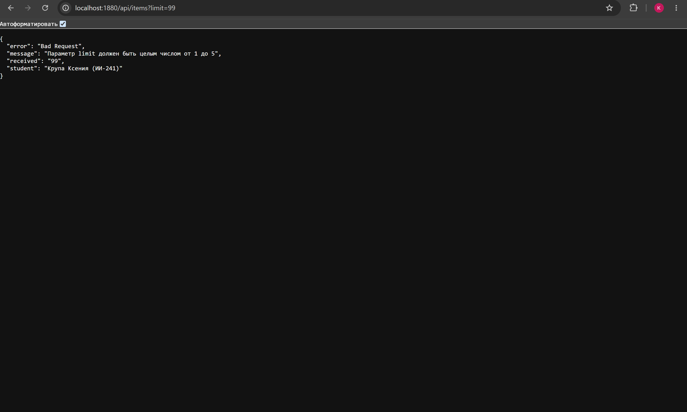

Ошибка `404` — товара с `id=42` нет:


### 4.9. Dashboard с gauge и графиком (`flow-09-dashboard.json`)

Установлен модуль `node-red-dashboard`. Дашборд доступен на <http://localhost:1880/ui>.

* Вкладка (tab): **«Датчик (Крупа)»**.
* Группа: **«Показания датчика»**.
* `ui_gauge` — текущее значение, шкала 0…40 °C, цветовые сегменты (зелёный → жёлтый → красный).
* `ui_chart` — история значений, линейный график, хранит 5 минут, ось `y` тоже 0…40.
* `inject` раз в 2 секунды имитирует датчик температуры (случайное число 18…30), `function` подставляет `msg.topic = lab2/krupa-ii241/dashboard`.

Значение из одной function-ноды расходится сразу в три ноды (gauge, chart, debug) — это показывает, что выход ноды можно ветвить.

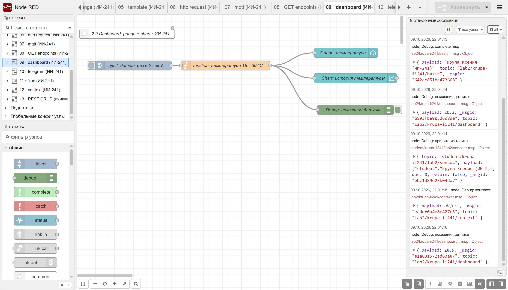

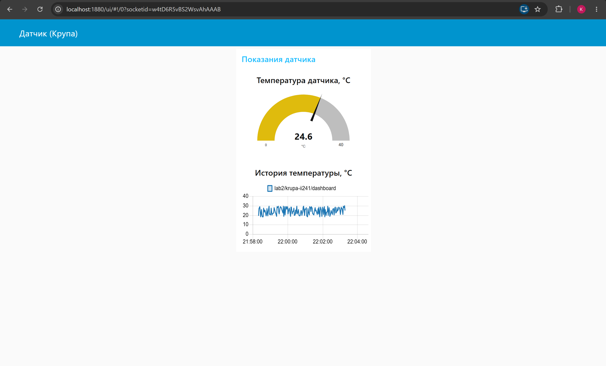

### 4.10. Telegram-бот (`flow-10-telegram.json`)

* Бот создан через **@BotFather**, имя: `tvl_lab2_krupa_bot`.
* Установлен модуль `node-red-contrib-telegrambot`.
* Токен вписывается в конфиг-ноду `telegram bot` (в репозитории стоит заглушка `TOKEN_FROM_BOTFATHER`, потому что токен — это секрет и в git его хранить нельзя).

Команды:

| Команда | Назначение |
|---------|-----------|
| `/start` | обязательная: приветствие и список возможностей |
| `/help` | список команд |
| `/time` | текущее время сервера Node-RED |
| любое другое сообщение | echo-ответ: «Эхо: <текст>» + время получения |

Технические детали:

* нода `telegram command` с галочкой `register` сама регистрирует описание команды в Telegram;
* `telegram receiver` отдаёт входящее сообщение, function-нода вытаскивает `chatId` **до** того, как перезаписать `payload`;
* сообщения, начинающиеся с `/`, в эхо-ветке отбрасываются (`return null`), иначе команды дублировались бы эхо-ответом;
* исходящее сообщение формируется как `msg.payload = { chatId, type: "message", content }`.

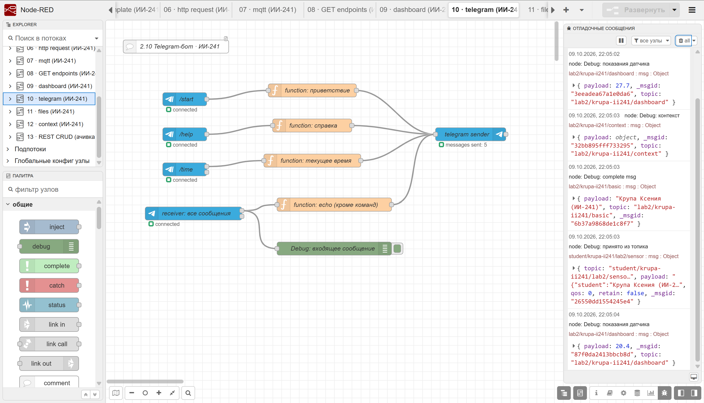

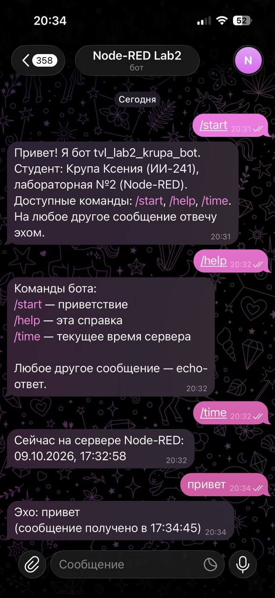

### 4.11. Чтение и запись файла (`flow-11-files.json`)

Один поток, две ветки.

**Запись:** `inject → function → file out`.
Файл: `/data/krupa-ii241-log.jsonl`, формат **JSON Lines** — одна строка = один JSON-объект.
Function-нода формирует запись и подставляет путь в `msg.filename` (в самой ноде путь стоит по умолчанию, но переопределяется из сообщения).

```json
{"ts":"2026-01-15T12:34:56.789Z","student":"Крупа Ксения (ИИ-241)","lab":2,"sensor":"temperature","value":23.7,"unit":"C"}
```

**Чтение:** `inject → file in → function → debug`.
Файл читается целиком как строка UTF-8, function-нода разбирает его построчно, пропускает повреждённые строки (`try/catch` внутри цикла) и считает статистику: количество записей, первое и последнее значение, минимум, максимум, среднее.

**Сохранение между перезапусками.** Файл лежит в `/data`, а `/data` — это смонтированная папка репозитория `lab2/node-red-data`, то есть данные физически на хосте. После `docker restart krupa-lab2-nodered` ветка чтения по-прежнему возвращает все ранее записанные строки.

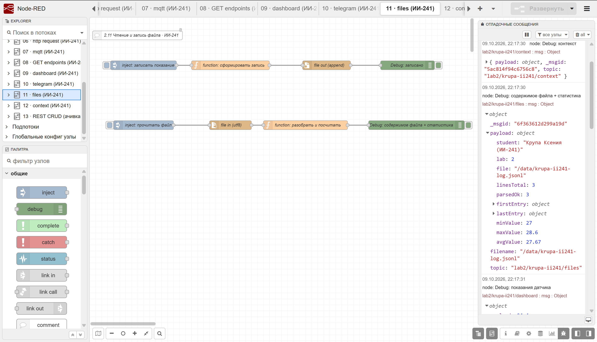

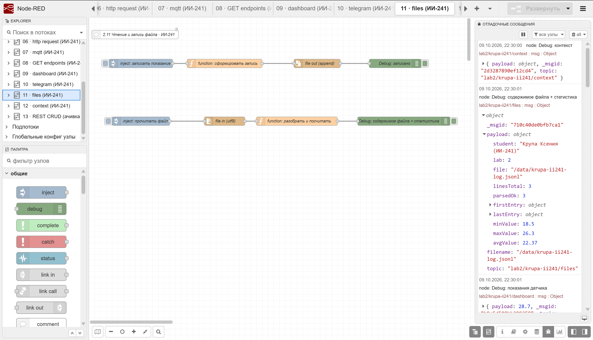

### 4.12. Работа с контекстом (`flow-12-context.json`)

Продемонстрированы сразу три механизма хранения состояния.

**1. Flow context — счётчик, живущий между сообщениями:**

```js
let counter = flow.get("krupa_counter");
if (typeof counter !== "number") { counter = 0; }
counter = counter + 1;
flow.set("krupa_counter", counter);
```

Inject раз в 3 секунды увеличивает счётчик на 1. Отдельный inject «сбросить счётчик» возвращает его в 0 — так видно, что значение действительно живёт в контексте, а не пересоздаётся при каждом сообщении.

**2. Global context — журнал последних пяти значений:**

```js
let history = global.get("krupa_history");
if (!Array.isArray(history)) { history = []; }
history.push({ n: counter, at: new Date().toISOString(), value: msg.payload });
if (history.length > 5) { history = history.slice(history.length - 5); }
global.set("krupa_history", history);
```

Отличие от flow context: область видимости — весь рантайм Node-RED, значение доступно из любого потока, а не только из текущего.

**3. Environment variables — настройки, приходящие снаружи:**

```js
const envStudent = env.get("LAB2_STUDENT") || "(переменная не задана)";
const envLab = env.get("LAB2_LAB") || "(переменная не задана)";
```

Переменные переданы контейнеру флагами `-e LAB2_STUDENT=Krupa -e LAB2_LAB=2` при `docker run`. Это позволяет менять поведение потока, не редактируя его: например, указать другую фамилию или другой номер лабораторной.

Важное наблюдение: **flow и global context живут в памяти процесса Node-RED**. Редеплой потока они переживают, а перезапуск контейнера — нет. Для настоящей персистентности нужен либо файл (см. 2.11), либо `contextStorage` с файловым хранилищем в `settings.js`, либо база данных (ачивка №10 — SQLite).

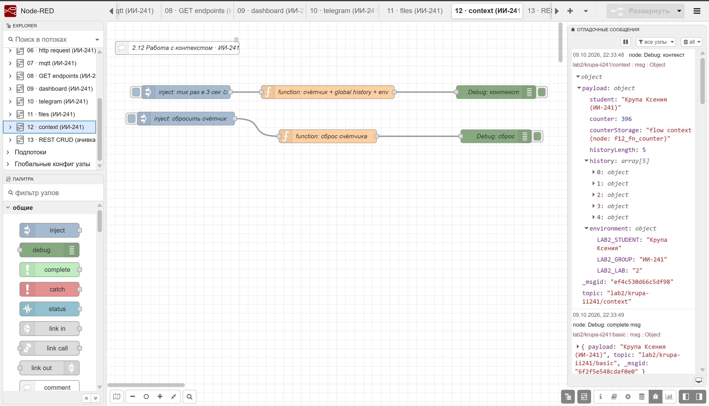

---

## 5. Ачивка №5 — REST+ (полный CRUD)

### 5.1. Что сделано

Сущность — **задача (`task`)** с двумя полями, как требует задание:

| Поле | Тип | Ограничения |
|------|-----|-------------|
| `title` | string | 3…100 символов, обязательное при создании |
| `done` | boolean | по умолчанию `false` |

| Метод | URL | Успех | Ошибки |
|-------|-----|-------|--------|
| GET | `/api/tasks` | 200 | 400 |
| GET | `/api/tasks/:id` | 200 | 400, 404 |
| POST | `/api/tasks` | 201 | 400 |
| PATCH | `/api/tasks/:id` | 200 | 400, 404 |
| DELETE | `/api/tasks/:id` | 200 | 400, 404 |

Полное описание с примерами запросов и ответов — в [`api.md`](api.md).

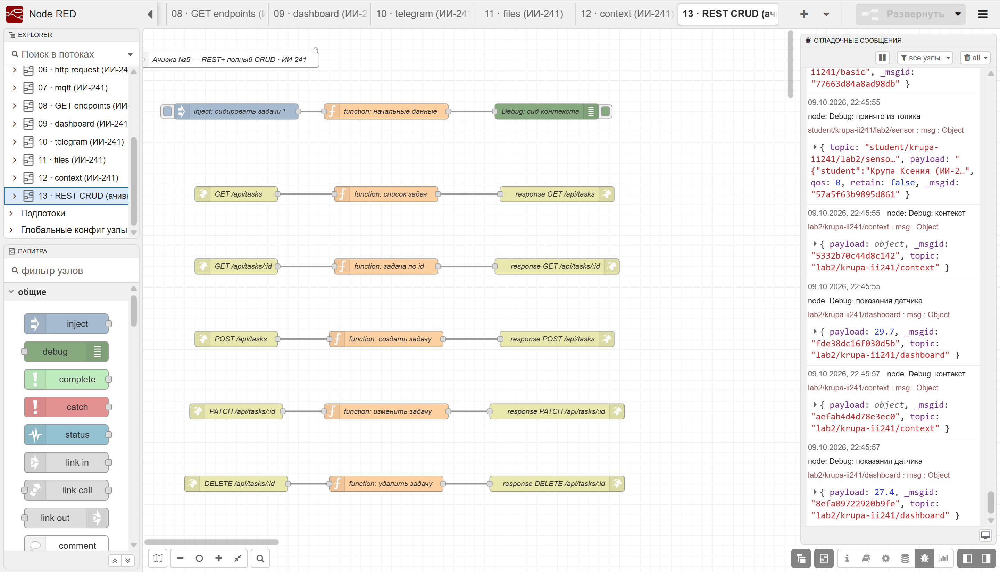

### 5.2. Хранение: почему flow context

Задание разрешает выбрать между `flow context`, `global context` и файлом. Выбран **flow context** (переменная `krupa_tasks`), и вот обоснование:

1. **Нет внешних зависимостей.** Не нужен ни модуль для SQLite, ни `fs` в function-ноде (в function-нодах по умолчанию `fs` недоступен — его надо отдельно подключать в `Setup → libs`), ни лишние ноды.
2. **Данных ровно столько, сколько нужно для демонстрации.** CRUD — это про контракт API, а не про объём хранения.
3. **Состояние живёт между сообщениями и переживает редеплой** — этого достаточно, чтобы последовательность «POST → GET → PATCH → DELETE» работала как единый сценарий.
4. **Известное ограничение честно названо:** перезапуск контейнера обнуляет контекст. Чтобы поток всегда был в рабочем состоянии, есть inject «сидировать задачи» с `once: true`, который после каждого деплоя наполняет контекст тремя тестовыми записями (и ничего не делает, если данные уже есть).
5. **Путь к продакшену очевиден и не требует менять API:** достаточно заменить четыре обращения к `flow.get/flow.set` на работу с файлом (поток 2.11) или с SQLite (ачивка №10) — все URL, коды и формат ответов останутся теми же.

### 5.3. Как устроена валидация

В каждой POST/PATCH-ноде работает общий набор проверок:

| Проверка | Код ответа |
|----------|-----------|
| тело запроса не объект (или массив) | 400 |
| `title` отсутствует или не строка | 400 |
| длина `title` вне диапазона 3…100 | 400 |
| `done` передан, но не boolean | 400 |
| PATCH без единого изменяемого поля | 400 |
| `id` не целое число | 400 |
| записи с таким `id` нет | 404 |

Все ответы об ошибках имеют единый формат, поэтому клиенту не нужно угадывать структуру:

```json
{
  "error": "Bad Request",
  "message": "Длина title должна быть от 3 до 100 символов",
  "student": "Крупа Ксения (ИИ-241)",
  "extra": { "received": "ok" }
}
```

### 5.4. Проверка

CRUD проверен через `curl`. Успешные сценарии и ошибки — на скриншотах.


---

## 6. Как проверялась работоспособность

Проверка делалась не «на глаз» — для каждого пункта есть зафиксированный результат.

### 6.1. Все потоки целиком — через поток отладочных сообщений

Node-RED отдаёт события панели Debug по WebSocket: `ws://localhost:1880/comms`.
Скрипт подключается к нему, дёргает inject-ноды через Admin API (`POST /inject/<id>`)
и собирает то, что реально дошло до debug-нод — то есть проверяется вся цепочка
целиком, а не только первая нода.

Результат: **34 сообщения, сработали все 12 debug-нод.**

| Пункт | Debug-нода | Результат |
|-------|------------|-----------|
| 2.1 | `Debug: complete msg` | `topic: lab2/krupa-ii241/basic`, `payload: "Крупа Ксения"` |
| 2.2 | `Debug: результат функции` | `inputType: "object"`, `values: [5,4,5,3]`, `avg: 4.25`, `verdict: "средний балл высокий"` |
| 2.3 | `ВЫХОД 1: avg >= 4` | `values: [5,5,4]`, `avg: 4.67` — сработало правило `>= 4` |
| 2.3 | `ВЫХОД 2: otherwise` | `values: [1,2,3]`, `avg: 2` — сработало `otherwise` |
| 2.4 | `Debug: complete msg после change` | `topic: lab2/krupa-ii241/change`, JSONata собрала строку с исходным payload |
| 2.5 | `Debug: собранный JSON` | `summary: "temperature: 27.4 C у студента Крупа Ксения"`, `Output = parsed JSON` |
| 2.6 | `Debug: ответ API` | пришёл объект от `api.chucknorris.io` с полями `id`, `value`, `url` |
| 2.7 | `Debug: принято из топика` | 4 сообщения вернулись из брокера, `topic: student/krupa-ii241/lab2/sensor` |
| 2.9 | `Debug: показания датчика` | 9 значений температуры, 18…30 °C |
| 2.11 | `Debug: содержимое файла + статистика` | `linesTotal: 3`, `parsedOk: 3`, `avgValue: 24.17` |
| 2.12 | `Debug: контекст` | счётчик растёт, `historyLength: 5` (журнал обрезается) |
| 2.12 | `Debug: сброс` | `counter: 0`, история очищена |

Итоговая строка скрипта: `ВСЕ ОЖИДАЕМЫЕ DEBUG-НОДЫ ОТРАБОТАЛИ`.

### 6.2. MQTT — независимым подписчиком

Чтобы убедиться, что сообщение действительно уходит в брокер, а не просто «показано
в Debug», на хосте запущен отдельный MQTT-клиент (пакет `mqtt` для Node.js),
который ничего не знает о Node-RED:

```
CONNECTED to broker.hivemq.com:1883
RECEIVED topic=student/krupa-ii241/lab2/sensor
payload={"student":"Крупа Ксения (ИИ-241)","lab":2,"sensor":"temperature","value":24.5,"unit":"C","ts":"2026-10-08T19:04:34.971Z"}
```

Сторонний клиент получил сообщение — значит публикация в 2.7 работает по-настоящему.

### 6.3. Файл переживает перезапуск

1. Ветку записи дёрнули три раза — в `lab2/node-red-data/krupa-ii241-log.jsonl` появились 3 строки.
2. `docker restart krupa-lab2-nodered`.
3. После запуска дёрнули ветку чтения:

```json
{
  "file": "/data/krupa-ii241-log.jsonl",
  "linesTotal": 3,
  "parsedOk": 3,
  "firstEntry": { "value": 28.8 },
  "lastEntry": { "value": 23.1 },
  "minValue": 20.6,
  "maxValue": 28.8,
  "avgValue": 24.17
}
```

Данные на месте: файл лежит в примонтированном volume, а не внутри контейнера.

Более жёсткая проверка: контейнер не просто перезапускался, а был полностью удалён
и создан заново (`docker rm -f` + `docker run` — это делает `lab2/scripts/deploy.ps1`).
Файл на хосте остался того же размера (375 байт), и ветка чтения снова вернула
`linesTotal: 3`. То есть данные привязаны к папке репозитория, а не к жизни контейнера.

### 6.4. HTTP-эндпоинты

| Запрос | Ожидание | Факт |
|--------|----------|------|
| `GET /api/text` | 200, plain text | 200, текст |
| `GET /api/info` | 200, JSON с двумя полями | 200, `{"student":…,"lab":2}` |
| `GET /api/items?limit=2` | 200, 2 записи | 200, `count: 2` |
| `GET /api/items?category=fruit&limit=5` | 200, только fruit | 200, `count: 2` |
| `GET /api/items?limit=99` | 400 | 400, про диапазон 1…5 |
| `GET /api/items?limit=abc` | 400 | 400 |
| `GET /api/items/3` | 200 | 200, товар «Клавиатура» |
| `GET /api/items/abc` | 400 | 400, `"id должен быть целым числом"` |
| `GET /api/items/42` | 404 | 404, `availableIds: [1,2,3,4,5]` |
| `GET /api/tasks` | 200, 3 задачи | 200, `total: 3` |
| `GET /api/tasks?done=true` | 200, только выполненные | 200, `count: 2` |
| `GET /api/tasks?done=yes` | 400 | 400 |
| `GET /api/tasks/2` | 200 | 200 |
| `GET /api/tasks/999` | 404 | 404 |
| `POST /api/tasks` (корректное тело) | 201, новая задача | 201, `id: 4`, `createdAt` заполнен |
| `POST /api/tasks` `{"title":"ok"}` | 400 | 400, про длину title |
| `POST /api/tasks` `[1,2,3]` | 400 | 400, тело не объект |
| `POST /api/tasks` `done: "yes"` | 400 | 400, done не boolean |
| `PATCH /api/tasks/3` `{"done":true}` | 200, добавился `updatedAt` | 200 |
| `PATCH /api/tasks/3` `{}` | 400 | 400, нужно хотя бы одно поле |
| `PATCH /api/tasks/999` | 404 | 404 |
| `DELETE /api/tasks/4` | 200, задача вернулась в ответе | 200 |
| повторный `DELETE /api/tasks/4` | 404 | 404 |

Все 23 проверки совпали с ожиданием.

### 6.5. Что не удалось проверить автоматически

**Telegram-бот (2.10).** Токен бота — секрет, в репозиторий он не попадает,
поэтому в контейнере стоит заглушка `TOKEN_FROM_BOTFATHER`. Node-RED честно
сообщает об этом в логе:

```
[warn] [telegram bot:f10_bot] Aborting: Token of tvl_lab2_krupa_bot is not set
[warn] [telegram command:/start] bot not initialized.
```

Проверяется вручную: вписать токен от @BotFather в настройки ноды `telegram bot`,
нажать Deploy и написать боту. Логика команд и эхо-ответа разобрана в п. 4.10.

**Dashboard (2.9).** Проверено, что модуль поднялся и UI отвечает
(`GET /ui/ → 200`, в логе `Dashboard version 3.6.6 started at /ui`), но сами
виджеты gauge и chart снимаются глазами — это скриншот `09a-dashboard-ui.png`.

---

## 7. Использованные AI-промпты

ИИ применялся на всех этапах — от установки до генерации кода function-нод и документирования. Ниже несколько ключевых промптов (не дословно все, а самые показательные).

### 7.1. Установка и запуск

> Разверни Node-RED в Docker Desktop на Windows. Мне нужен официальный образ, порт 1880 и обязательно volume, который монтирует локальную папку из моего репозитория в `/data` внутри контейнера. Объясни каждый флаг в команде `docker run` и подскажи, как передать в контейнер переменные окружения, чтобы потом читать их в function-ноде через `env.get()`.

Что получилось: команда `docker run` с разбором флагов, позже оформленная в п. 2.2, и идея передать `LAB2_STUDENT` / `LAB2_LAB` для потока 2.12.

### 7.2. Код для function-ноды

> Напиши код для function node в Node-RED. На вход приходит что угодно — число, строка, массив или объект. Нужно определить тип входа и посчитать статистику: количество элементов, сумму и среднее. В коде обязательно используй `let`/`const`, `if/else`, цикл `for`, массив и объект. Функция должна вернуть объект с полем `payload`, внутри которого будут student, inputType, values, count, sum, avg и текстовый verdict. Добавь комментарии на русском.

Что получилось: код из п. 4.2, который затем переиспользуется в потоке 2.3 (switch).

### 7.3. Эндпоинты с параметрами и ошибками

> Сделай в Node-RED эндпоинт `GET /api/items`, который читает query-параметры `limit` и `category`. Если `limit` не целое число или вне диапазона 1…5 — вернуть 400 с JSON-описанием ошибки. Ещё нужен `GET /api/items/:id`, который берёт id из path-параметра: если id не число — 400, если товара нет — 404. Код ответа выставляй через `msg.statusCode`, заголовки — через `msg.headers`. Объясни, где Node-RED хранит query- и path-параметры.

Что получилось: третий и четвёртый эндпоинты потока 2.8; заодно выяснилось, что параметры лежат в `msg.req.query` и `msg.req.params`.

### 7.4. Ачивка: REST CRUD

> Реализуй в Node-RED полноценный CRUD для сущности task с двумя полями title (string, 3…100 символов) и done (boolean). Нужны GET /api/tasks, GET /api/tasks/:id, POST /api/tasks, PATCH /api/tasks/:id, DELETE /api/tasks/:id. Храни данные в flow context. Добавь валидацию входных данных и корректные коды 200, 201, 400, 404. Ошибки возвращай в едином формате с полями error, message, student и extra. Объясни, почему для этой задачи уместен flow context и какие у такого хранения ограничения.

Что получилось: поток `flow-13-rest-crud.json` и раздел 5 этого отчёта — включая честный разбор ограничений in-memory хранения.

### 7.5. Документирование

> Собери по коду моих потоков документацию API в формате Markdown: таблица эндпоинтов, параметры, примеры запросов и ответов, включая ошибки 400 и 404. Отдельно опиши сквозной сценарий проверки CRUD.

Что получилось: файл [`api.md`](api.md). Отдельно пришлось разобраться с коварной вещью: в Windows PowerShell 5.1 вызов `curl.exe -d '{"title":"..."}'` теряет кавычки, и вместо JSON на сервер уходит `{title:...}` — Node-RED отвечает ошибкой разбора. Поэтому в документации примеры с телом запроса даны в двух вариантах: `Invoke-RestMethod` для PowerShell и `curl` для bash.

### 7.6. Что ИИ сделал не сразу (и как это исправлялось)

* В Telegram-боте первая версия echo-ветки отвечала и на команды тоже — получался двойной ответ на `/start`. Пришлось добавить отбрасывание сообщений, начинающихся с `/`.
* В idempotent-версии CRUD отсутствовала проверка «PATCH без полей» — запрос `{}` возвращал 200 и просто переписывал `updatedAt`. Добавили 400.
* В шаблоне Mustache подстановка `{{payload.value}}` без кавычек ломала JSON, если значение приходило строкой. Оставили числовой тип и проверили результат глазами в Debug.
* При чтении файла в 2.11 первая версия падала на пустом файле. Добавили проверку на пустую строку и `try/catch` на разбор каждой строки.

---

## 8. Выводы

1. **Node-RED действительно позволяет собрать рабочий бэкенд без написания «каркаса».** HTTP-сервер, парсинг тела запроса, JSON-сериализация ответа, MQTT-клиент, работа с файлами — всё это уже реализовано нодами. Код пишется только там, где нужна бизнес-логика, то есть в function-нодах.

2. **Главная экономия — на инфраструктуре, а не на логике.** Поток `http in → function → http response` заменяет сразу Express-роут, middleware для `express.json()` и сериализацию ответа. Но валидацию, коды состояния и формат ошибок всё равно приходится продумывать самому — low-code не отменяет проектирования.

3. **«Low-code» ≠ «без кода».** Самые содержательные части работы — CRUD-логика, ветвление, работа с контекстом, разбор файла — это обычный JavaScript внутри function-нод. Визуальным оказалось то, что вокруг: маршрутизация сообщений, конфигурация подключений, обработка ошибок.

4. **Состояние — самое неочевидное место.** Пришлось разбираться, чем отличаются `msg`, flow context, global context и переменные окружения, и где что живёт: `msg` — на одно сообщение, flow context — на один поток до редеплоя/рестарта, global — на весь рантайм, env — задаётся снаружи при запуске. Ошибка в выборе уровня хранения ломает логику незаметно: поток работает, пока не перезапустишь контейнер.

5. **Порог входа низкий, а потолок высокий.** Базовый поток `inject → debug` собирается за минуту, но дальше приходится разбираться с MQTT-брокерами, JWT, SQLite, WebSocket, написанием собственных нод — то есть инструмент растёт вместе с задачей, а не упирается в потолок, как большинство конструкторов.

6. **Отладка визуального потока удобнее текстовой.** Панель Debug показывает сообщение целиком на каждом участке цепочки, и не нужно расставлять `console.log` и перезапускать сервер, чтобы понять, где сообщение потерялось. На потоке MQTT это особенно заметно: видно и то, что было отправлено, и то, что вернулось от брокера.

7. **Docker + volume — обязательная связка для учебной работы.** Без volume данные из потока 2.11 исчезали бы вместе с контейнером, и требование «показать сохранение между перезапусками» выполнить было бы невозможно. Заодно volume решает проблему переноса: `flows.json` лежит в папке репозитория, а не в недрах виртуальной машины Docker.

8. **Самое трудоёмкое в этой лабораторной — не собрать поток, а сделать его воспроизводимым и объяснимым.** Поток, который работает «здесь и сейчас», и поток, который можно импортировать из файла, задокументировать и защитить, — это две разные работы. Больше всего времени ушло на вторую: комментарии на полотне, отдельные `flow-NN-*.json`, описание эндпоинтов и обоснование выбранного хранилища.
