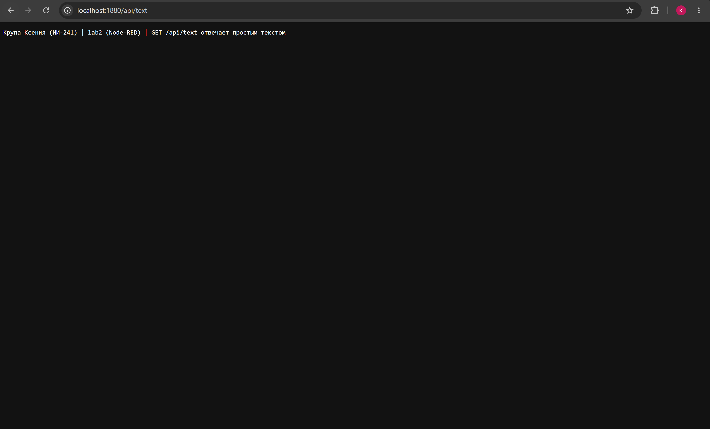
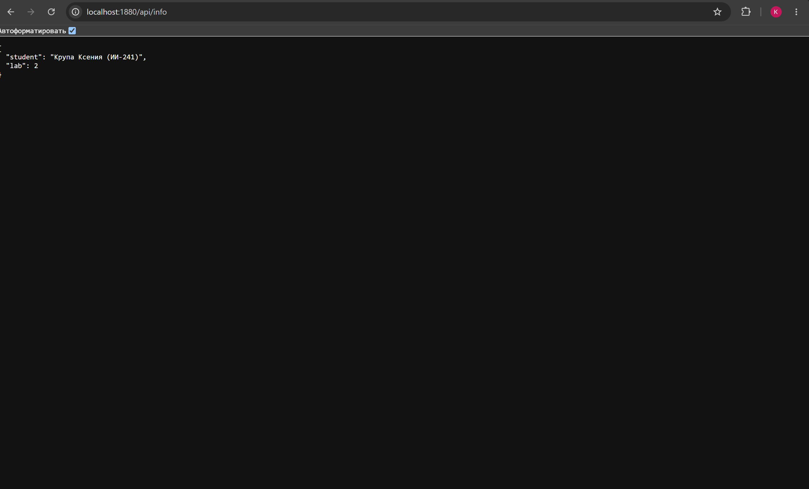
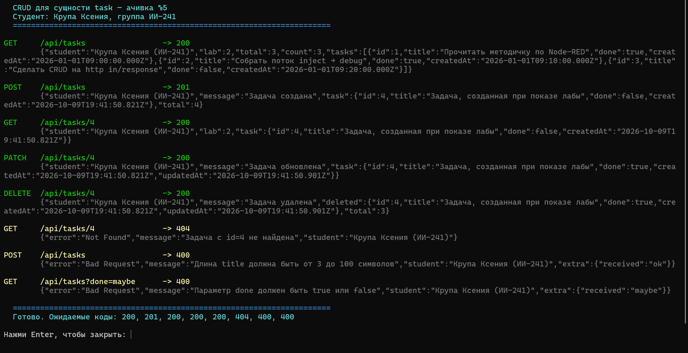

# Отчёт по лабораторной работе №2

**Тема:** Node-RED как low-code инструмент
**Студент:** Крупа Ксения, группа ИИ-241
**Университет:** ГрГУ им. Я. Купалы

## 1. Краткое описание выполненного

Node-RED установлен в Docker-контейнере и запущен на порту 1880. Собраны все
двенадцать потоков из Части 2 задания (пункты 2.1–2.12) и один поток на ачивку —
всего 13 потоков, 116 нод. Каждый поток сохранён отдельным файлом в `flows/`,
как требует задание.

Из Части 3 выбрана **ачивка №5 «REST+ (полный CRUD)»**: пять HTTP-эндпоинтов
для создания, чтения, изменения и удаления задач.

Описание всех HTTP-эндпоинтов с примерами запросов и ответов вынесено
в [api.md](api.md).

Проверка: все потоки прогнаны через поток отладочных сообщений Node-RED
(сработали все 12 debug-нод), девять эндпоинтов проверены запросами
(23 проверки, все коды ответов совпали с ожидаемыми), работа MQTT подтверждена
сторонним подписчиком.

## 2. Способ установки и версии

Установка через Docker, образ `nodered/node-red:latest`. Обязательный по заданию
volume монтирует папку `node-red-data` в `/data` внутри контейнера, порт 1880.

```powershell
docker run -d --name krupa-lab2-nodered `
  -p 1880:1880 `
  -v "D:\lab2-help\node-red-data:/data" `
  --env-file "D:\lab2-help\scripts\lab2.env" `
  --restart unless-stopped `
  nodered/node-red:latest
```

| Компонент | Версия |
|---|---|
| Node-RED | v5.0.8 |
| Node.js | v24.21.0 |
| Docker | 29.8.0 |
| node-red-dashboard | 3.6.6 |
| node-red-contrib-telegrambot | 19.0.3 |


## 3. Освоенные ноды

| Нода | Где применена | Что освоено |
|---|---|---|
| `inject` | 2.1–2.7, 2.9, 2.11, 2.12 | ручной запуск, повтор по таймеру, задание нескольких свойств сразу |
| `debug` | все потоки | вывод только payload и вывод всего сообщения целиком |
| `function` | 2.2, 2.3, 2.7–2.13 | JavaScript в ноде: `let`/`const`, `if/else`, цикл `for`, массивы, объекты |
| `switch` | 2.3 | ветвление по полю сообщения на два выхода |
| `change` | 2.4 | перезапись полей, добавление времени, вычисление выражением |
| `template` | 2.5 | шаблон Mustache, сборка JSON из объекта |
| `http request` | 2.6 | GET-запрос к публичному API |
| `mqtt in` / `mqtt out` | 2.7 | публикация и подписка через публичный брокер |
| `http in` / `http response` | 2.8, ачивка | методы GET, POST, PATCH, DELETE, параметры в адресе, коды ответов |
| `file` / `file in` | 2.11 | запись в файл с дописыванием и чтение целиком |
| `ui_gauge`, `ui_chart`, `ui_group`, `ui_tab` | 2.9 | дашборд: показания датчика и график истории |
| `telegram bot`, `telegram command`, `telegram receiver`, `telegram sender` | 2.10 | бот с командами и ответом на любое сообщение |

Дополнительно освоены: `flow context` и `global context` для хранения состояния,
переменные окружения через `env.get()`, а также `msg.statusCode` и `msg.headers`
для управления ответом сервера.

## 4. Потоки и скриншоты

### 4.1. Inject → Debug (пункт 2.1)

Inject раз в 5 секунд отправляет строку с фамилией в `msg.payload`, а в `msg.topic`
кладёт `lab2/krupa-ii241/basic`. Debug переключён в режим вывода всего сообщения,
поэтому в панели видны `payload`, `topic` и `_msgid`.


Исходник: [flow-01-inject-debug.json](../flows/flow-01-inject-debug.json)

### 4.2. Function node (пункт 2.2)

Три inject-ноды подают в одну функцию число, строку и объект. Функция определяет
тип входа, считает статистику и возвращает объект с полем `payload`.


Исходник: [flow-02-function.json](../flows/flow-02-function.json)

### 4.3. Switch node (пункт 2.3)

Та же логика, что в 2.2. Switch ветвит сообщение по полю `payload.avg`: первое
правило — больше или равно 4, второе — все остальные случаи. Два Debug на разные
выходы.


Исходник: [flow-03-switch.json](../flows/flow-03-switch.json)

### 4.4. Change node (пункт 2.4)

Change перезаписывает `topic`, добавляет текущее время в `timestamp`, служебное
поле `changedBy` и собирает новый payload выражением.


Исходник: [flow-04-change.json](../flows/flow-04-change.json)

### 4.5. Template node (пункт 2.5)

Mustache-шаблон собирает из объекта готовый JSON. Output стоит в режиме разбора,
поэтому на выходе получается объект, а не строка.


Исходник: [flow-05-template.json](../flows/flow-05-template.json)

### 4.6. HTTP Request node (пункт 2.6)

Запрос к публичному API без регистрации и токенов. Ответ приходит уже разобранным
объектом.


Исходник: [flow-06-http-request.json](../flows/flow-06-http-request.json)

### 4.7. MQTT с публичным брокером (пункт 2.7)

Публичный брокер `broker.hivemq.com:1883`, топик `student/krupa-ii241/lab2/sensor`.
Одна ветка публикует случайное показание датчика раз в 5 секунд, вторая подписана
на тот же топик и печатает пришедшее сообщение в Debug. Сообщение возвращается
из брокера — это и есть доказательство, что публикация и подписка работают.


Исходник: [flow-07-mqtt.json](../flows/flow-07-mqtt.json)

### 4.8. GET-эндпоинты (пункт 2.8)

Три эндпоинта, у каждого своя пара `http in` и `http response`:

| Эндпоинт | Что возвращает | Ошибки |
|---|---|---|
| `/api/text` | простой текст | — |
| `/api/info` | JSON с двумя полями | — |
| `/api/items?limit=&category=` | список товаров | 400 при неверном `limit` |
| `/api/items/:id` | один товар по номеру из адреса | 400 и 404 |

Четвёртый эндпоинт добавлен, чтобы закрыть и параметры запроса, и параметры
адреса.


Исходник: [flow-08-endpoints.json](../flows/flow-08-endpoints.json)

Все три эндпоинта проверены в браузере:





Третий эндпоинт показан двумя запросами — успешным и с ошибкой:


### 4.9. Dashboard с gauge и графиком (пункт 2.9)

Установлен модуль `node-red-dashboard`. Дашборд открывается на
`http://localhost:1880/ui`. Inject раз в 2 секунды имитирует датчик температуры,
показание уходит сразу в gauge, chart и Debug.


Исходник: [flow-09-dashboard.json](../flows/flow-09-dashboard.json)


### 4.10. Telegram-бот (пункт 2.10)

Установлен модуль `node-red-contrib-telegrambot`. Бот `tvl_lab2_krupa_bot` отвечает
на команды `/start`, `/help`, `/time` и повторяет любое сообщение. Токен в
репозиторий не попадает — в файле потока стоит заглушка.


Исходник: [flow-10-telegram.json](../flows/flow-10-telegram.json)


### 4.11. Чтение и запись файла (пункт 2.11)

Один поток, две ветки. Ветка записи дописывает строку JSON в файл
`/data/krupa-ii241-log.jsonl`, ветка чтения разбирает файл и считает статистику.
Файл лежит в примонтированном volume, поэтому данные сохраняются между
перезапусками контейнера.


Исходник: [flow-11-files.json](../flows/flow-11-files.json)

После перезапуска Node-RED чтение возвращает те же три строки:


### 4.12. Работа с контекстом (пункт 2.12)

Показаны три способа хранения данных. Счётчик в `flow context` живёт между
сообщениями, журнал последних значений в `global context` доступен из любого
потока, а переменные окружения `LAB2_STUDENT`, `LAB2_GROUP` и `LAB2_LAB`
передаются контейнеру при запуске.


Исходник: [flow-12-context.json](../flows/flow-12-context.json)

## 5. Ачивка №5 — REST+ (полный CRUD)

Сущность — задача с двумя полями: `title` (строка от 3 до 100 символов) и `done`
(выполнена или нет). Номер `id` сервер присваивает сам.

| Метод | Адрес | Что делает | Успех | Ошибки |
|---|---|---|---|---|
| GET | `/api/tasks` | список задач | 200 | 400 |
| GET | `/api/tasks/:id` | одна задача | 200 | 400, 404 |
| POST | `/api/tasks` | создать | 201 | 400 |
| PATCH | `/api/tasks/:id` | изменить | 200 | 400, 404 |
| DELETE | `/api/tasks/:id` | удалить | 200 | 400, 404 |

Хранение — в `flow context`. Этот вариант разрешён заданием и не требует
дополнительных модулей, а данные при этом живут между запросами и переживают
передеплой потока. Ограничение честное: при перезапуске контейнера контекст
обнуляется, поэтому есть нода `inject: сидировать задачи`, которая после каждого
деплоя кладёт в него три тестовые задачи. Перейти на постоянное хранение можно,
не меняя ни одного адреса — например, на файл, как в потоке 2.11.

Валидация проверяет: тело запроса является объектом, поле `title` есть и подходит
по длине, поле `done` логического типа, в адресе целое число, задача с таким
номером существует.


Исходник: [flow-13-rest-crud.json](../flows/flow-13-rest-crud.json)

Полный сценарий проверки одной командой — все операции и коды ответов:



Подробное описание эндпоинтов с примерами запросов: [api.md](api.md).

## 6. Использованные AI-промпты

Несколько ключевых примеров.

**Установка.** «Разверни Node-RED в Docker Desktop на Windows. Нужен официальный
образ, порт 1880 и обязательно volume, который монтирует папку на хосте в `/data`
внутри контейнера. Объясни каждый флаг в команде `docker run` и подскажи, как
передать переменные окружения, чтобы читать их в function-ноде».

**Код для function-ноды.** «Напиши код для function node. На вход приходит число,
строка или объект. Определи тип входа и посчитай статистику: количество элементов,
сумму и среднее. Используй `let`/`const`, `if/else`, цикл `for`, массив и объект.
Функция должна вернуть объект с полем `payload`».

**Эндпоинты с параметрами.** «Сделай эндпоинт `GET /api/items` с параметрами
`limit` и `category`. Если `limit` не целое число или вне диапазона — верни 400.
Ещё нужен `GET /api/items/:id`: если id не число — 400, если товара нет — 404.
Код ответа выставляй через `msg.statusCode`».

**Ачивка.** «Реализуй полный CRUD для сущности task с полями title и done.
Пять эндпоинтов, хранение в flow context, валидация, коды 200, 201, 400, 404.
Ошибки в едином формате. Объясни, почему уместен flow context и какие у такого
хранения ограничения».

**Документирование.** «Собери по кодам моих потоков документацию API в Markdown:
таблица эндпоинтов, параметры, примеры запросов и ответов, включая ошибки.
Отдельно опиши сквозной сценарий проверки CRUD».

Что приходилось исправлять после ИИ: в Telegram-боте первая версия отвечала эхом
и на команды тоже, получался двойной ответ; в CRUD не было проверки «PATCH без
полей»; при чтении файла код падал на пустом файле.

## 7. Выводы

Node-RED позволяет собрать рабочий бэкенд почти без написания кода. HTTP-сервер,
разбор тела запроса, отправка ответа, MQTT-клиент, работа с файлами — всё это уже
есть готовыми нодами, и код пишется только там, где нужна бизнес-логика. Главная
экономия при этом не в логике, а в инфраструктуре: цепочка `http in` — `function` —
`http response` заменяет сразу и роут, и разбор JSON, и формирование ответа. Но
валидацию, коды состояния и формат ошибок всё равно приходится продумывать
самому — low-code не отменяет проектирования.

Самым неочевидным оказалось хранение состояния. Пришлось разбираться, чем
отличаются сообщение, контекст потока, глобальный контекст и переменные
окружения, и где что живёт. Ошибка в выборе уровня хранения ломает логику
незаметно: поток работает, пока не перезапустишь контейнер. Отладка при этом
удобнее текстовой: панель Debug показывает сообщение целиком на каждом участке
цепочки, и не нужно расставлять вывод в код, чтобы понять, где оно потерялось.

Самое трудоёмкое в работе — не собрать поток, а сделать его воспроизводимым и
объяснимым. Поток, который работает сейчас, и поток, который можно импортировать
из файла, задокументировать и защитить, — это две разные работы. Больше всего
времени ушло на вторую: подписи на полотне, отдельные файлы потоков, описание
эндпоинтов и обоснование выбранного хранилища.
